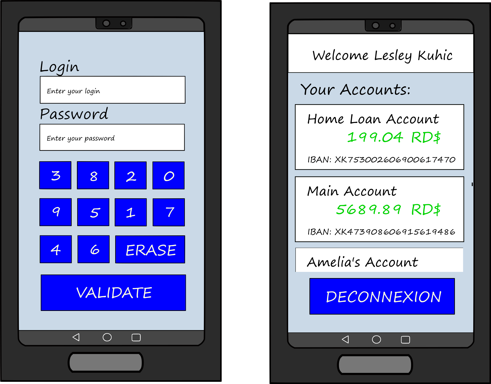

# M1 Secure Development : Mobile applications

### Our aswers

<b>- Explain how you ensure user is the right one starting the app.</b>

  When a user start for the first time the app, he will enter a password and a login which will be his. While he doesn't clear his local database these password and login would be the only identifiers that display the accounts.
  The password is hashed and the database is encrypted.
  
<b>- How do you securely save user's data on your phone ?</b>

The link with the API is secured with TLS exchanges.
The encrypted database has a random local generated key which is loaded in the encrypted file. We used the garbage collector in order to keep in memory the data 
as short a time as possible.
The screenshots are forbidden not to leak any sensitive data.
In addition, we add the enigma module which encrypted code and include false secret.

<b>- How did you hide the API url ?</b>

We used steganography to hide the API URL. We took advantage of having sound in our app to hide the data in the sound 'bip.wav' with LSB method.
Moreover, the enigma module will encrypt the url in the apk.
  
- Screenshots of your application 

 <b>ADD SCREENSHOTS</b>


### General operation and features

#### General operation
On the launch of the app a user will see a home page which contains our logo and some instructions. On the click of the 'next' button, the login page is displayed.
When a client wants to use our app he will on his first connection create his login and password which will be his until he cleared his local database.

#### Features :

- We added sounds and vibrations for a better user experience. Moreover, the user could choose if sound and vibrations preferences to have or not this feature.
- The screenshots are forbidden in order to keep the user data secret.
- ...

### Model and preview
In order to have an idea of what we wanted to have as an application we did a model:



# Instructions we had:

Hey you all,  
In this repository you will find everything you need to do the workshop.

## Report guidelines

- You create a github/gitlab public project **only** containing:
  - Your source code in a **src** folder
  - <your_application>.apk
  - README.md
- You send your repository link **before 11pm59 on the 1th february 2021**. After this timeline, you will loose 1pts per hour.

## Exercice

Using Android Studio (or any editor of your choice), you will have to create a mobile application.  
You can choose the language you want between Kotlin and Java.  

The goal is to create a secure application to see your bank accounts.   

### Requirements
- This application must be available offline.
- A refresh button allows the user to update its accounts.
- Only the phone's user can start the app
- Exchanges with API must be secure ( with TLS)


### API
https://6007f1a4309f8b0017ee5022.mockapi.io/api/m1/:endpoint


```json
/config/1
You only have "read" rights on the config enpoint. 

  {
    "id": "1",
    "name": "Lesley",
    "lastname": "Kuhic"
  }
```


```json
/accounts
You can read and create new accounts. You cannot modify, nor delete.

  {
    "id": "2",
    "account_name": "Home Loan Account",
    "amount": "199.04",
    "iban": "XK753002606900617470",
    "currency": "RD$"
  }
```


### README.md content

- Explain how you ensure user is the right one starting the app
- How do you securely save user's data on your phone ?
- How did you hide the API url ?
- Screenshots of your application 

### Report scoring

- Your README file contains answers to the asked questions (2pts)

Your APK will be audited in the same way as a classic mobile pentest 
- You start with 10pts and you will loose points if:
    - Your application doesn't respect requirements (-10pts)
    - Api url is recoverable (-2pts)
    - Your application can be accessed by any user (-2pts)
    - Stored data can be recovered (-2pts)
    - Permissions are too wide (-2pts)
- The originality of your solution is scored on 3
- The complexity of your solution is scored on 5
- UX/UI will not be scored


