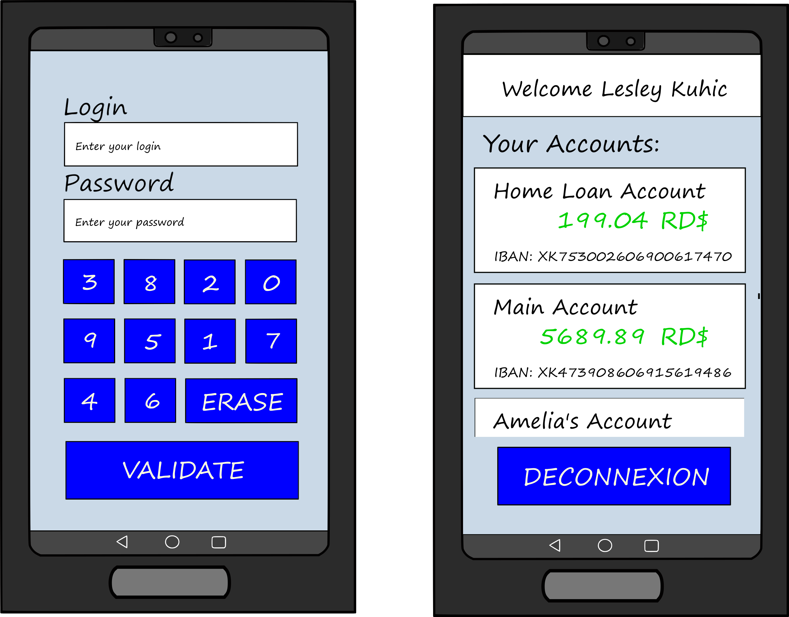

# M1 Secure Development : Mobile applications


Our goal was to create a secure application to see your bank accounts.   

## <u>Requirements</u>

- This application must be available offline.
- A refresh button allows the user to update its accounts.
- Only the phone's user can start the app
- Exchanges with API must be secure ( with TLS)


### API

https://6007f1a4309f8b0017ee5022.mockapi.io/api/m1/:endpoint


```json
/config/1
You only have "read" rights on the config enpoint. 

  {
    "id": "1",
    "name": "Lesley",
    "lastname": "Kuhic"
  }
```


```json
/accounts
You can read and create new accounts. You cannot modify, nor delete.

  {
    "id": "2",
    "account_name": "Home Loan Account",
    "amount": "199.04",
    "iban": "XK753002606900617470",
    "currency": "RD$"
  }
```


## <u>Our answers</u>

- <b>Explain how you ensure user is the right one starting the app :</b>

When the database is empty (first launch or after cleaning), the user define his username and password at the first connection. After that, theses credentials are the only ones able to enter the app. For defining his password, the user use a random generated keybard : with that, his "pattern" is never the same.


- <b>How do you securely save user's data on your phone ?</b>

Firstly, the password defined by the user is encrypted before being stored in database.

After that, at first connection and when refreshing data, we use secured Internet communication with TLS (by default since API 20 ; we are 30) and certificate pinning (see "certificate pinning" folder to use certif_pin.sh and getting key).

When recovered, data are stored in database encrypted with sqlcypher. The database key is randomly generated in user's device at first use of the app and then stored in the shared preferences.

All sensitive data (login, passwords, data retrieved by restApi...) are memory-secured, either by usage of the garbage collector (var = null) or with GuardedObject (for in-thread usage)

There are two more security mechanism when app is running. Firstly, the app does not authorize screen-shots when used. Secondly, when the app is paused, the connect page is automatically loaded, so even in the "recent app" panel, another user cannot see the account list.

At APK building, we applied proguard for getting one-word methods and variables, in addition of enigma for encrypt strings in plain text with AES and random generated key. Little warning about that last point : enigma generate an EnigmaUtils class which store the list of keys (see https://github.com/christopherney/Enigma/blob/a03207395db839e189143e83d44e5a0501e81c7f/src/main/java/com/chrisney/enigma/tasks/InjectCodeTask.java) : then, it is more like a form of obfuscation.


- <b> How did you hide the API url ?</b>

We have tried to use steganography to hide the API URL. Since it didn't worked, we automate transformation of a string into an image (see "makeImg.py" in stegano" folder) and we reverse the operation in Java. Then, the url and the pin certificate are stored as a combination of bytes, 3 per pixels. Warning, do not take all pixels : you must jump to one color square to another. Good luck.


- <b>~~Screenshots~~ Video of your application </b>

#### Scenario 1 : first connection and persistence


#### Scenario 2 : data suppression


#### Scenario 3 : life cycle security


#### Scenario 4 : features (login/password security, anti screen, light/dark themes, parameters)


## <u>General operation and features</u>

#### General operation
On the launch of the app a user will see a home page which contains our logo and some informations. On the click of the 'next' button, the login page is displayed.
When a client wants to use our app he will on his first connection create his login and password which will be his until he cleared his local database.


#### Features :

- We added sounds and vibrations for a better user experience. Moreover, the user can choose whatever he wants sound and vibrations or not.
- We support both English (by default) and French languages, depending of your device's configuration
- The screen-shots are forbidden in order to keep the user data secret.
- The user can create as many accounts as he wants. By defaults, theses accounts are not added online. When sent online and refreshed, created account's data will be replaced by randomly generated data.
- The user can clear his whole database for simulate a new install of the application. Hey, it's a demonstrator, isn't it?


### Preview model
We started by make a draft of our application in order to respond to ours requirements :



